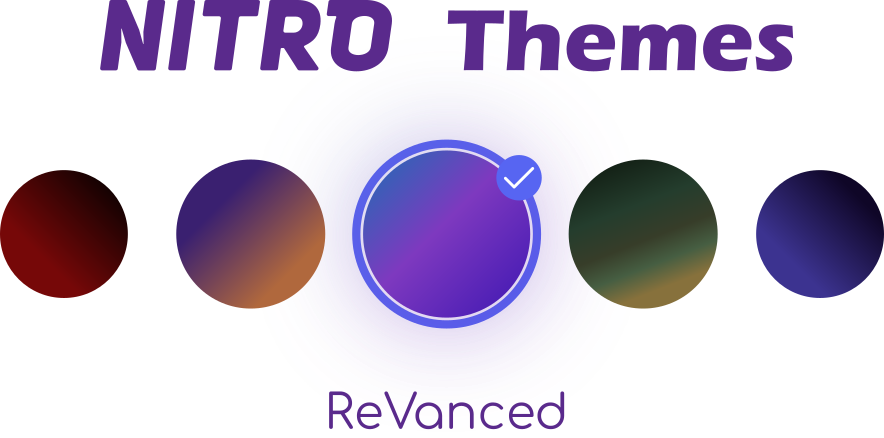
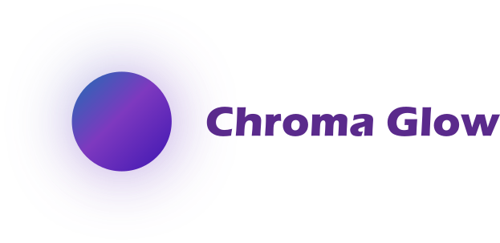

> **Note:** You accessed a link that returned a 404, probably by clicking one of the plugin links. You're supposed to copy the link address and add it into Vendetta.

# Available themes
<a href="https://github.com/DodoLeDev/NitroThemes-Revanced/tree/main/plugins/ChromaGlow"></img></a>

## Credits
- Thanks to the [Vendetta Team](https://github.com/vendetta-mod) for their incredible application!
- A big thank you to [@aeongdesu](https://github.com/aeongdesu/) and his [ClientTheme](https://github.com/aeongdesu/vdplugins/tree/main/plugins/ClientTheme) plugin!
